# Machine-Learning

## Lab 3

### Task 1

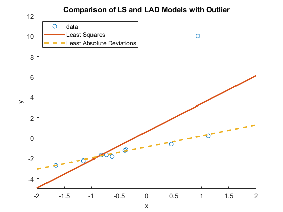 

### Task 2

 

### Task 3

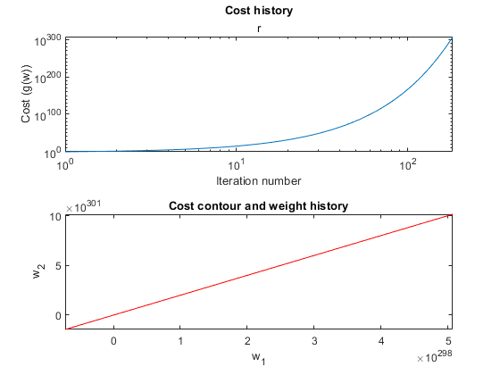 

### Task 4

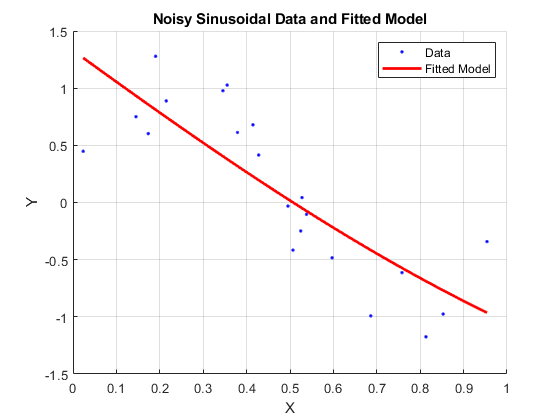 

### Task 5

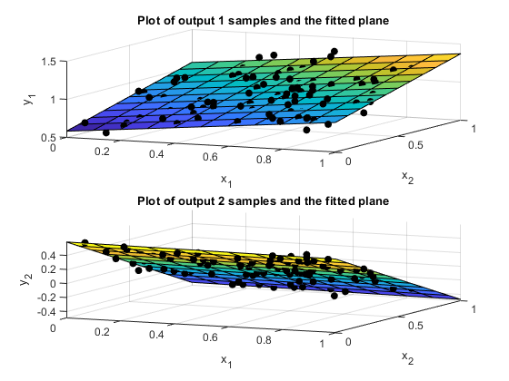 

## Lab 4

### Task 1

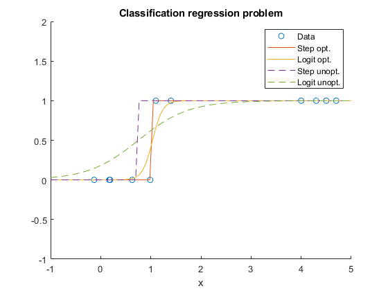 
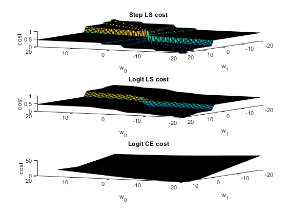 

### Task 2

 

### Task 3

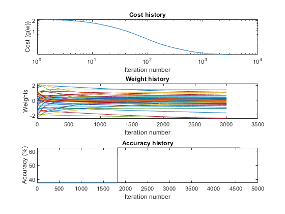 

## Lab 5

### Task 2

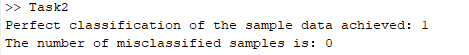 

### Task 4

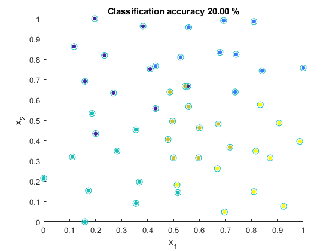 

## Lab 6

### Task 1

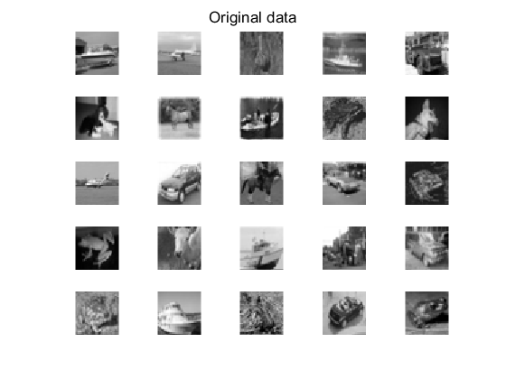 
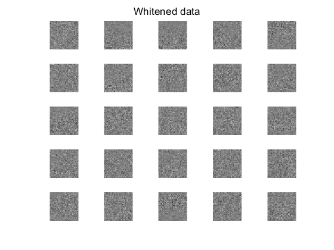 
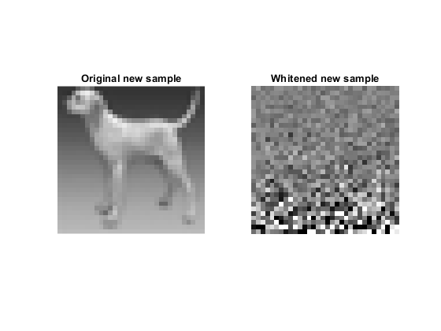 

